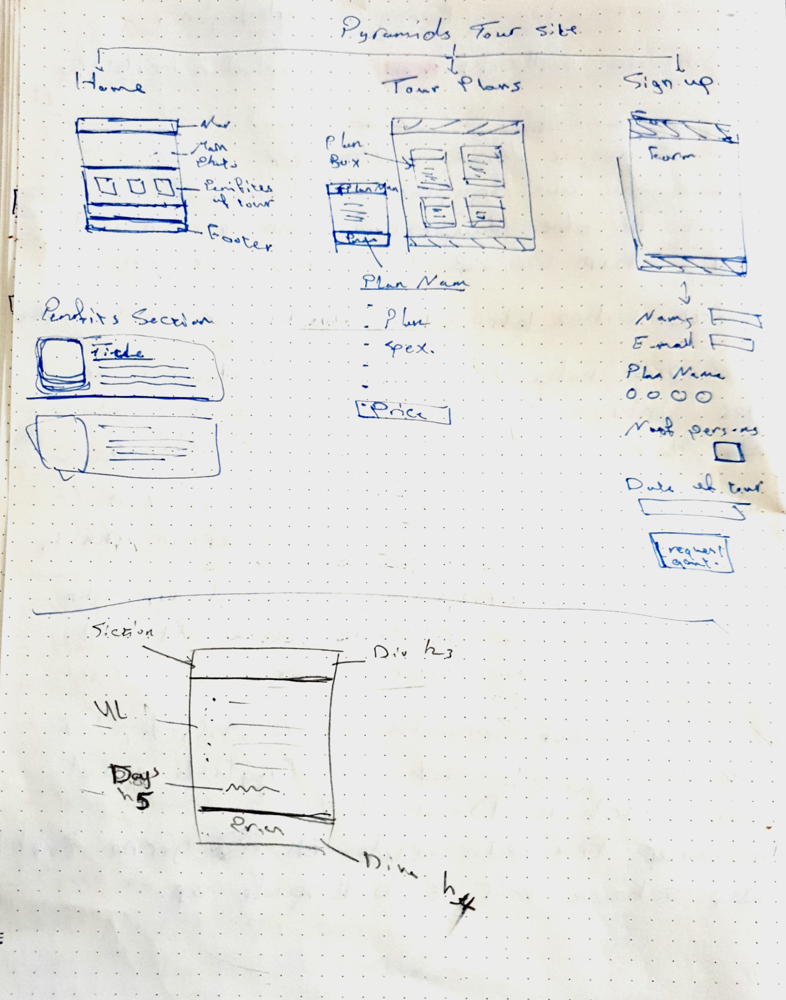
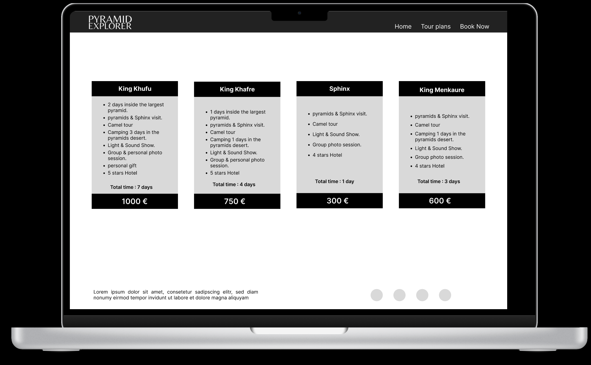

[# [PYRAMIDEXPLORER](https://ibra8080.github.io/pyramidexplorer)

---
# PyramidExplorer

Picture yourself immersed in the majesty of one of the Seven Wonders of the World, a structure steeped in over 7,000 years of history. Such an experience is truly unforgettable, and it's precisely what PyramidExplorer offers.

At PyramidExplorer, we specialize in crafting extraordinary adventure programs centered around camping and exploration amidst the legendary pyramids of Giza. Our website serves as a gateway to these remarkable experiences, offering a glimpse into the wonders that await.

Our homepage greets you with a captivating hero image, setting the stage for the extraordinary adventures that await. As you scroll, discover the core values that define our commitment to excellence: authenticity, adventure, and awe-inspiring experiences. Learn how we craft each expedition with meticulous attention to detail, ensuring that every moment is infused with wonder and discovery.

But the adventure doesn't stop there. Dive deeper into the essence of our expeditions with our gallery section, where stunning visuals from past trips transport you to the ancient wonders of Egypt. Immerse yourself in the magic of the pyramids, the allure of the desert, and the timeless beauty of the Sphinx.

With seamless navigation, customers can effortlessly transition from browsing to booking, with direct access to our reservation page from any section of the site. Simplify the journey from inspiration to exploration with PyramidExplorer.

At PyramidExplorer, your journey is not just a trip—it's an unforgettable odyssey through the annals of time. Begin your exploration today."

source: [amiresponsive](https://ui.dev/amiresponsive?url=https://ibra8080.github.io/pyramidexplorer)

## UX

I drew a quick sketch of the site's layout and pages

and then used Figma to create a Wireframe, making sure it was responsive

### Colour Scheme

I used a color scheme derived from the colors of the clear sky in Cairo with the colors of the desert and the pyramids. 

- `#3a3a3a` used for primary text.
- `#3462BF` used for primary highlights.
- `#3a3a3a` used for secondary text.
- `#D9984A` used for secondary highlights.

I used [color.adobe.com](https://color.adobe.com/search?q=pyramids%20) to generate my colour palette.

### Typography

- [Inter-Black-Bold](https://fonts.google.com/specimen/Inter?query=inter) was used for the primary headers and titles.

- [Inter-Light-Regular](https://fonts.google.com/specimen/Lato) was used for all other secondary text.

- [Font Awesome](https://fontawesome.com) icons were used throughout the site, such as the social media icons in the footer.

## Wireframes

### Mobile Wireframes

 Click here to see the Mobile Wireframes 

Home
  - 
  - 

Plans
  - 
  - 

Booknow
  - 

### Tablet Wireframes

 Click here to see the Tablet Wireframes 

Home
  - 

About
  - 

Booknow
  - 

### Desktop Wireframes

 Click here to see the Desktop Wireframes 

Home
  - 
  - 

Plans
  - 

Booknow
  - 

Gallery
  - 

## Features

### Existing Features

- **A large main interface image-#1**

    - A large main interface image to put the user directly into the atmosphere of the event.

- **Icons for all features-#2**

    - Icons for all basic features to make it easier for the user to remember and increase clarity.

- **A photo gallery-#3**

    - A photo gallery on the home page to enable the user to browse photos and learn more about trip details.

- **The Call to Action button-#4**

    - The Call to Action button is present on every page to make it easier for the user to reach the booking page.

- **Displaying plans-#5**

    - Displaying the different plans in a way that makes it easy to compare the features and price of each plan and choose the most appropriate one for the user.

- **The booking form-#6**

    - The booking form is simple and easy to use.

- **Links to social-media are located on the footer-#7**

    - Links to the project pages on social media are located on the footer of each page to enable the user to quickly access them and increase familiarity with the project. They open on separate pages so that the user does not lose continuity in browsing the site.

### Future Features

- Add a blog in which news of the latest trips is published.
    - It is updated periodically with the possibility of creating separate events in it
- Add a section for customers reviews to share their experiences and photos.
    - Can be used by users directly.
- Adding the ability to design a customized plan for the user.
- Add a video for each feature of the trip.

## Tools & Technologies Used

-  used to generate README and TESTING templates.
-  used for version control. (`git add`, `git commit`, `git push`)
-  used for secure online code storage.
-  used as a cloud-based IDE for development.
-  used for the main site content.
-  used for the main site design and layout.
-  used for hosting the deployed front-end site.
-  used for creating wireframes.
-  used for the icons.
-  used to help debug, troubleshoot, and explain things.

