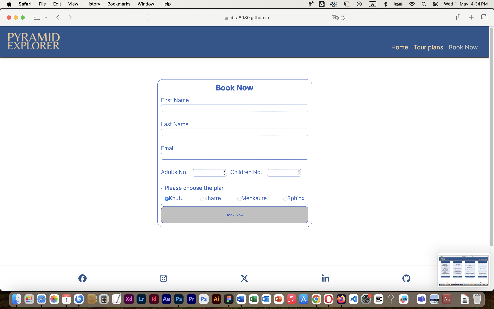
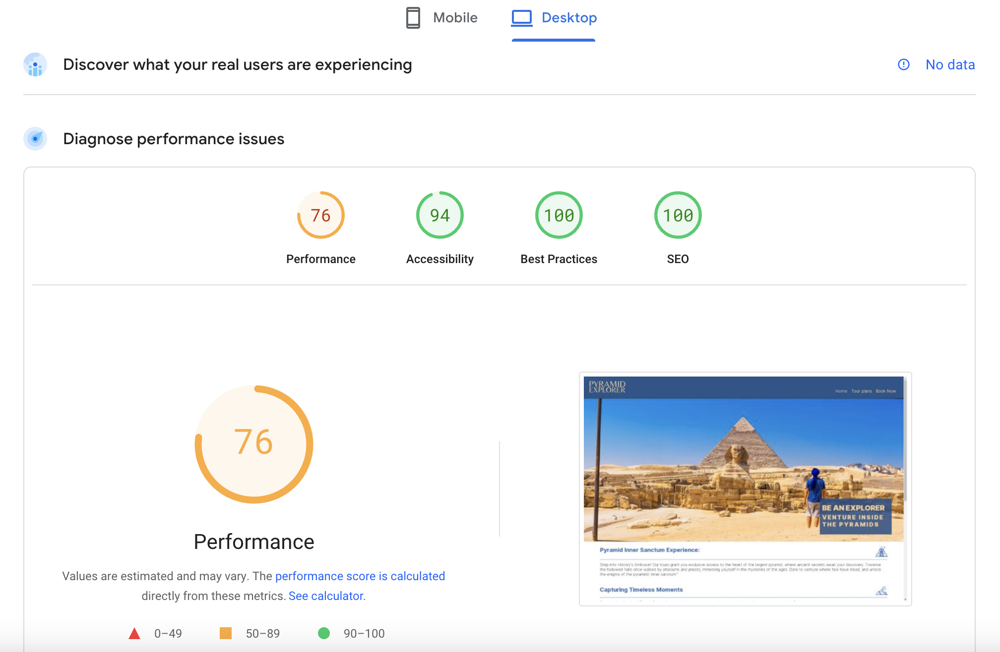

# Testing

> [!NOTE]  
> Return back to the [README.md](README.md) file.

## Code Validation

### HTML

I have used the recommended [HTML W3C Validator](https://validator.w3.org) to validate all of my HTML files.

| Directory | File | Screenshot | Notes |
| --- | --- | --- | --- |
|  | index.html |  | |
|  | book-now.html |  | |
|  | tour-plans.html |  | |
|  | confirmation.html |  | |
|  | 404.html |  | |

### CSS

I have used the recommended [CSS Jigsaw Validator](https://jigsaw.w3.org/css-validator) to validate all of my CSS files.

| Directory | File | Screenshot | Notes |
| --- | --- | --- | --- |
| assets | style.css |  | |

The only error that appears in the test is from the code imported from the fancyapps.com to build the gallers section 

## Browser Compatibility

I've tested my deployed project on multiple browsers to check for compatibility issues.

| Browser | Home | tour-plans | BookNow |
| --- | --- | --- | --- |
| Chrome |  |  |  |  |
| Firefox |  |  |  |  | Works as expected |
| Safari |  |  |  |  | Minor CSS differences |
| Opera |  |  |  |  | Minor differences |

## Responsiveness

I've tested my deployed project on multiple devices to check for responsiveness issues.

| Device | Home | Tours plans | BookNow |
| --- | --- | --- | --- |
| Mobile (DevTools) |  |  |  |  |
| Tablet (DevTools) |  |  |  |  |
| Desktop |  |  |  |   |

## Lighthouse Audit

I've tested my deployed project using the Lighthouse Audit tool to check for any major issues.

| Page | Mobile | Desktop | Notes |
| --- | --- | --- | --- |
| Home |  |  | Some minor warnings |
| Tours |  |  | Some minor warning|
| Booknow |  |  | Slow response time due to large images |

